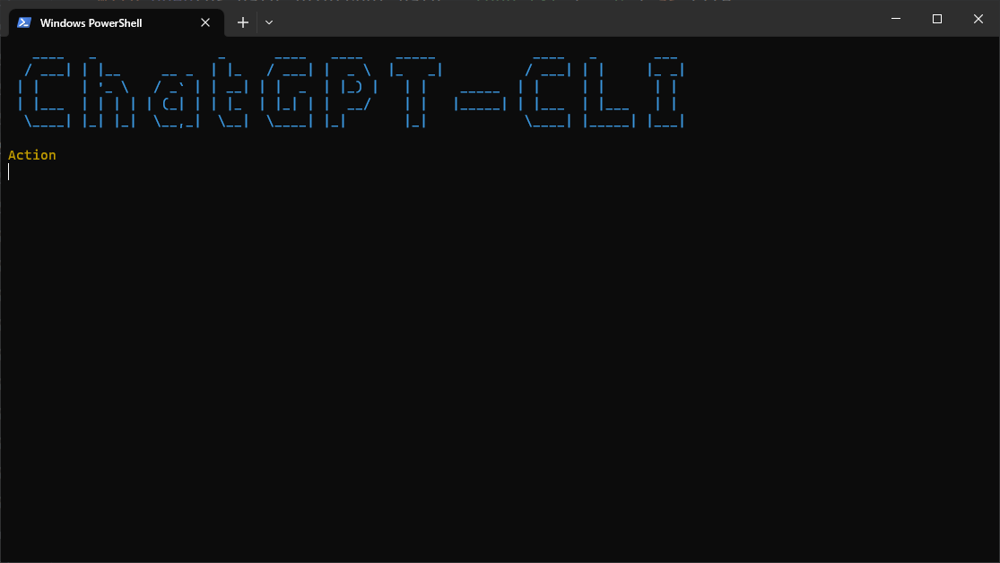
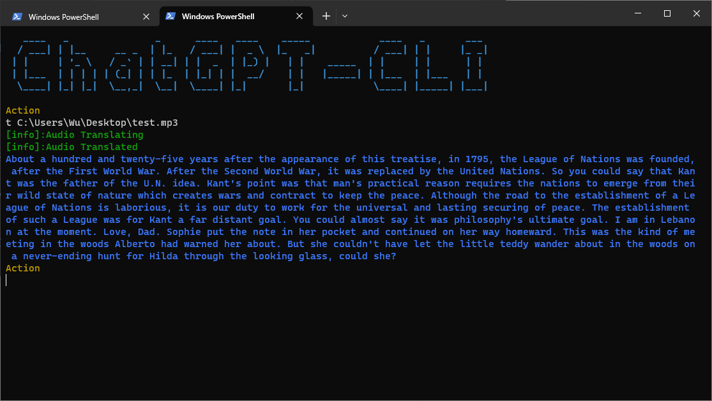

<h1 style="text-align:center;">ChatGPT-CLI</h1>
<h3 style="text-align:center;">基于OpenAI API开发的命令行工具</h3>
<div style="text-align:center">
  
</div>


### 主要功能
· 文字聊天  
· 图片生成  
· 音频转文字  
· 一键启动  
· 聊天记录保存  
· 快速响应

### 启动之前
1. 准备好你的 [OpenAI API Key](https://platform.openai.com/account/api-keys)
2. 在系统环境变量中新增一条变量```OPENAI_API_KEY```，变量值为你的[OpenAI API Key](https://platform.openai.com/account/api-keys)

### 启动项目
1. 下载项目到本地  
2. 安装依赖库 ```pip install -r requirements.txt```
3. 启动项目 ```python.exe main.py```

### CMD快速启动  
如果你需要在 CMD 中使用 chat 命令来快速启动项目，你需要进行如下操作：

1. 修改项目中的chat.bat文件，根据本地情况修改python的解释器目录和main.py文件目录
```angular2html
@echo off
D:\code\ChatGPT-CLI\Virtualenv\Scripts\python.exe D:\code\ChatGPT-CLI\main.py
PAUSE
```
2. 在系统环境变量PATH中新增chat.bat的地址，即可在cmd中输入chat命令快速启动项目 
<div style="text-align:center">
  
</div>

### PowerShell快速启动  
如果你需要在 PowerShell 中使用 chat 命令，你需要进行如下操作：

1. 打开 PowerShell，输入 ```$PROFILE```，按回车键。如果提示 “文件未找到”，那么你需要创建 PowerShell 配置文件。 创建一个新的配置文件，输入```New-Item $PROFILE –type file –force```。
建议右键运行 PowerShell 作为管理员。  
2. 用任意文本编辑器打开 PowerShell 配置文件(第一步创建的文件)
3. 将以下命令添加到文件末尾：```function chat {python.exe D:\code\ChatGPT-CLI\main.py}```,注意根据本地情况修改python解析器路径和main.py文件路径
4. 保存文件并关闭文本编辑器。

现在你可以在 PowerShell 中使用 chat 命令来快速运行该项目了。
<div style="text-align:center">
  
</div>

### 项目配置
在使用前

### 如何使用
该项目共有五个选项```chat file save image audio```，当程序提示```Action```时即可输入选项并进入对应的模式，输入```quit```可以退出该程序，也可以直接关闭程序:D，接下来将分别介绍各个选项的作用：  
#### chat
进入文字聊天模式
#### file
设置当前程序使用哪一个对话记录，如果不设置，则默认开启一个新的对话
#### save
保存当前的对话记录，通常不需要手动调用，因为对话在退出后会自动保存,保存路径为程序所在目录，文件名为当前日期，文件名可以手动修改
#### image
输入图片描述，返回图片的url，该图片和url不会自动保存，需要用户手动下载保存
#### audio
输入音频文件的路径，返回该音频翻译的文字内容  

**注意**：所有选项都可以通过输入```quit```返回主菜单

### 自定义程序
修改main.py文件中的部分代码来定制化你的聊天机器人:D
```python
system_prompt: str = "You are a helpful assistant."
model: str = "gpt-3.5-turbo"
temperature: int = 1
n: int = 1
stream: bool = True
stop: bytes = None
max_tokens: int = 2048
presence_penalty: int = 0
frequency_penalty: int = 0
```
参数的具体含义参考[OpenAI API官网](https://platform.openai.com/docs/api-reference)

### 使用截图
<div style="text-align:center">
  
</div>
<div style="text-align:center">
  
</div>  
<div style="text-align:center">
  
</div>  